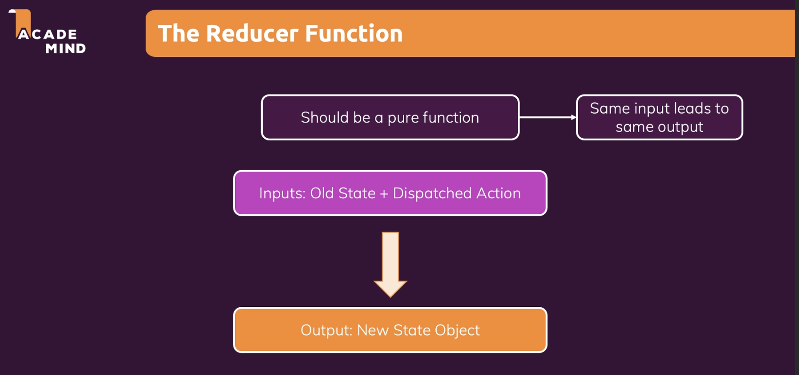

# react_udemy

## Practice react by making react project in udemy lecture

### section 1~8
learning about basic of react and js grammar  
learning  about useState, React.createElement() (why we need to import React from 'react' before)   
learning about styled components  

### section 9
learning about debugging  
using react dev tools, and error message to fix bug  

### section 10
make projects using props, useState, eventHadler, Card component, Button component

### section 11
learning about Wrapper, React.fragment to reduce using 
;  
learning about what is useRef, and how to use;  
learning about controled(using state)/uncontroled(using ref) component  

### section 12
learning about Side Effects, Reducers & Context    
useEffect execute after all other components re-loading when dependencies change    
learning how to use useEffect   

#### useState vs useReducer
useReducer can use when a complex state we use. useReducer is more powerful state management    
useState is using in main state and useful in symple update  
useReducer is using in related pieces of state/data or complex state updates  

#### context API
using context API when managing global state  
It is not suitable for use if it changes frequently. -> Redux is better way  
not use context API in everything  
  
#### Rules of Hooks
   

### section 13
practice to make react app  
how to use useReducer, useState, useEffect, useRef...  

### section 14
learn about How React work(virtual DOM <-> real DOM)  
if some state changing, always rendering all components. And change changed components in real DOM.
how to use React.memo()
React.memo : compare old props and new props, if changed the props then revaluated components. It only can use in functional components not class component.  
React need space that save the old props, and need to compare old props and new props. All it is cost.  
If rerendering, all const, function, etc... is created new. If raw value, it doesn't matter about using React.memo. But if function, new function that do same work isn't same function. So it can't use React.memo in function.  
learn about how to use useMemo.

### section 15
learn about what is class component  
no more using but it's important past project.   

### section 16
learn how to transmit http    
using Star Wars API    
learn about server response 2xx ~ 5xx  
using firebase to study get, post request using fetch  

### section 17
learn about custom hook    
custom hook must need to start name in 'use'; it give information to react that this is custom hook.    
using custom hook to fetch data  
using .bind() to avoid deep nesting  

### section 18
leran about how to make form validation 
learn about how to make input form using useState or customHooks

### section 18 2 
By updating of lecture, section number is changed. So this is second section 18.  
Learn how to make project by a to z to try to make app  
Learn how to use useEffect cleanup function. Clean up works before updating or Unmounting.  
It doesn't work at first time rendering.  

### section 19
Learn about Redux
redux : state management system for cross-component or app-wide state
Both can use in Cross-Component State and App-Wide State (redux and context)  
Learn about how to use redux in class component.  
using export default connect(mapStatetoProps, mapDispatchToProps)(Counter) and this
how to use reduxjs/toolkit. It use immer package so it makes automatically make copy object. so it's easy to make function  

#### context - Potentinal Disadvantages  
- Complex Setup /Management

- Performance
Redux is much better tool than context.   
React Context is not optimized for high-frequency state changes

#### Core Redux Concepts

Central Data(State) Store -> Subscription -> Component.  
Component don't direct change central data.  
We need to use Reducer Function. - It doesn't same useReducer().  
Action -> simple js object. 

#### Reducer Function

### section 20
Practice redux one more time.  
Using redux in async system - firebase backend  
add async await using useEffect to App.js  
Thunk : A function that delays an action until later
Learn how to use redux devtool

### section 21
Make SPA page with react router.